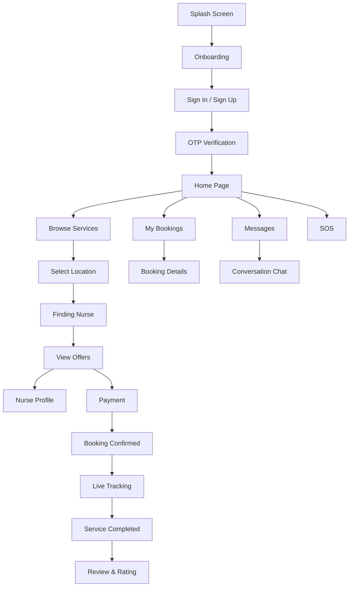

<p align="center">
  
</p>

<h1 align="center">نبض — NABDH</h1>
<p align="center">
  <em>رعاية تمريضية منزلية متميزة بين يديك</em><br/>
  <strong>Premium Home Nursing Care at Your Fingertips</strong>
</p>

<p align="center">
  
  
  
  
</p>

---

## 📖 Overview

**NABDH (نبض)** is a mobile application that connects patients with certified home nurses. Users can browse available nursing services, request service, review nurse offers, confirm bookings, make payments, chat with nurses, and track their bookings — all from the comfort of their home.

The app is built entirely with **Flutter**, follows a **feature-first architecture**, and is fully **RTL (Right-to-Left)** to natively support the Arabic language.

---

## ✨ Features

| Feature | Description |
|---|---|
| **Onboarding** | Smooth multi-page introduction showcasing the app's value proposition |
| **Authentication** | Sign Up, Sign In, and OTP verification screens |
| **Home Dashboard** | Central hub displaying service categories, promotions, and quick actions |
| **Service Request** | Browse all nursing services, set location, and submit a request |
| **Nurse Offers** | Receive and compare offers from multiple nurses with ratings and pricing |
| **Nurse Profile** | View detailed nurse profiles including experience, certifications, and reviews |
| **Finding Nurse** | Animated searching experience while matching with available nurses |
| **Booking Confirmation** | Summary screen after a successful booking is made |
| **Payment** | Choose between online payment or cash, with full price breakdown |
| **Review & Rating** | Rate and review the nurse after service completion (5-star rating + comment) |
| **My Bookings** | Track all bookings with filter tabs (upcoming, completed, cancelled) |
| **Booking Details** | Full booking breakdown with service info, nurse details, and status timeline |
| **Messaging** | Inbox of conversations with nurses |
| **Conversation** | Real-time chat interface with a nurse, including text messages and attachments |
| **Live Tracking** | Track the nurse's location en route to the patient on a map |
| **Nurse Registration** | Nurse-side data upload and verification flow |
| **SOS** | Emergency quick-access action for urgent nursing needs |

---

## 🏗️ Architecture

The project follows a **feature-first** folder structure with clear separation of concerns:

```
lib/
├── main.dart                         # App entry point
├── Splash_Screen.dart                # Animated splash screen
├── onboarding.dart                   # Onboarding flow
│
├── Core/
│   ├── Features/                     # Feature modules
│   │   ├── Auth/                     # Authentication (Sign In, Sign Up, OTP)
│   │   │   └── Presentation/View/
│   │   ├── home/                     # Home page
│   │   │   └── Presentation/View/
│   │   ├── request_service/          # Service request flow
│   │   │   └── Presentation/View/    # (AllServices, Location, FindingNurse,
│   │   │                             #  Offers, NurseProfile, ConfirmedBooking)
│   │   ├── payment/                  # Payment screen
│   │   │   └── Presentation/View/
│   │   ├── review/                   # Post-service review
│   │   │   └── Presentation/View/
│   │   ├── MyBooking/                # Booking management
│   │   │   └── Presentation/View/    # (MyBooking list, BookingDetails)
│   │   ├── Message/                  # Messaging feature
│   │   │   └── Presentation/View/    # (Message list, Conversation)
│   │   ├── live_tracking/            # Live nurse tracking
│   │   │   └── Presentation/View/
│   │   └── NurseHome/                # Nurse-side home (Data + Presentation)
│   │
│   ├── Util/                         # Shared utilities
│   │   ├── app_colors.dart           # App color palette
│   │   └── app_assets.dart           # Asset path constants
│   │
│   └── helper/                       # Helper functions
│       ├── my_navigator.dart         # Navigation utilities
│       ├── app_validator.dart        # Form validators
│       └── show_snack_bar.dart       # Snackbar helper
│
├── Nurse/                            # Nurse registration flow
│   ├── Data_check.dart
│   └── Data_upload.dart
│
└── Widgets/                          # Shared widgets
    └── Introduction.dart             # Onboarding page widget
```

---

## 🎨 Design System

| Token | Value | Usage |
|---|---|---|
| **Primary** | `#00685F` | Buttons, headers, active states |
| **Scaffold BG** | `#FFFFFF` | Screen background |
| **Border Grey** | `#E3E6EA` | Card borders, dividers |
| **Black** | `#1A1C1C` | Primary text |
| **Hint Grey** | `#3E4947` | Secondary text, subtitles |
| **Font Family** | Alexandria | App-wide Arabic-optimized typeface |
| **Design Size** | 390 × 955 | Base design dimensions for `flutter_screenutil` |

---

## 📦 Dependencies

| Package | Version | Purpose |
|---|---|---|
| [flutter_screenutil](https://pub.dev/packages/flutter_screenutil) | ^5.9.3 | Responsive UI scaling |
| [flutter_svg](https://pub.dev/packages/flutter_svg) | ^2.3.0 | SVG asset rendering |
| [smooth_page_indicator](https://pub.dev/packages/smooth_page_indicator) | ^2.0.1 | Onboarding page indicators |
| [dio](https://pub.dev/packages/dio) | ^5.10.0 | HTTP networking |
| [json_annotation](https://pub.dev/packages/json_annotation) | ^4.12.0 | JSON serialization annotations |
| [dartz](https://pub.dev/packages/dartz) | ^0.10.1 | Functional programming (Either type) |
| [flutter_bloc](https://pub.dev/packages/flutter_bloc) | ^9.1.1 | State management (BLoC/Cubit) |

### Dev Dependencies

| Package | Version | Purpose |
|---|---|---|
| [flutter_lints](https://pub.dev/packages/flutter_lints) | ^6.0.0 | Lint rules |
| [json_serializable](https://pub.dev/packages/json_serializable) | ^6.14.0 | JSON code generation |
| [build_runner](https://pub.dev/packages/build_runner) | ^2.15.0 | Code generation runner |

---

## 🚀 Getting Started

### Prerequisites

- **Flutter SDK** ≥ 3.x (Dart SDK ^3.11.4)
- **Android Studio** or **VS Code** with Flutter extension
- A connected device or emulator

### Installation

```bash
# 1. Clone the repository
git clone https://github.com/your-username/nabdh.git
cd nabdh

# 2. Install dependencies
flutter pub get

# 3. Generate serialization code (if needed)
dart run build_runner build --delete-conflicting-outputs

# 4. Run the app
flutter run
```

### Build for Production

```bash
# Android APK
flutter build apk --release

# iOS
flutter build ios --release

# Web
flutter build web --release
```

---

## 📱 App Flow



---

## 🗂️ Assets

```
assets/
├── Font/
│   └── Alexandria-Regular.ttf        # Primary Arabic font
├── NABDH Premium Logo.png            # App logo
├── Icon.svg                          # Small branding icon
├── Map.png                           # Map placeholder
├── Promo_bg.png                      # Promotional banner background
├── SOS.svg                           # Emergency SOS icon
└── [Service category SVGs]           # تمريض منزلي، حقن و محاليل، etc.
```

---

## 🤝 Contributing

1. Fork the repository
2. Create your feature branch (`git checkout -b feature/amazing-feature`)
3. Commit your changes (`git commit -m 'Add amazing feature'`)
4. Push to the branch (`git push origin feature/amazing-feature`)
5. Open a Pull Request

---

## 📄 License

This project is private and proprietary. All rights reserved.

---

<p align="center">
  Made with ❤️ using Flutter
</p>
